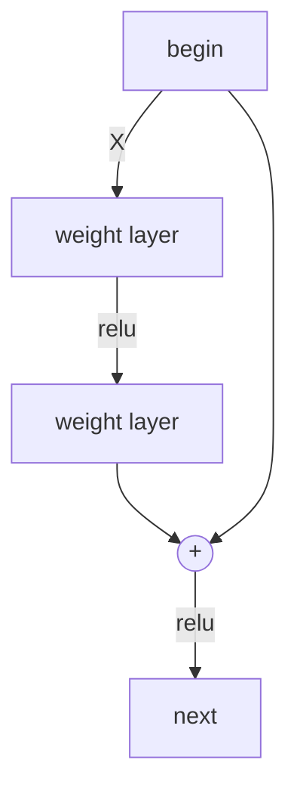

# 
 深度残差网络(ResNet)
## 
残差学习
对于一个堆积层结构，当输入为x时，其学习特征为H(x), 残差记为F(x), 则F(x)=H(x)-x, 既原始特征为F(x)+x

#### 
残差单元
残差单元为： 

$y_l$=h($x_l$) + F($x_l$,$W_l$) 

$x_{l+1}$=f($y_l$)

其中$x_l$和$x_{l+1}$分别表示的是第l个残差单元的输入和输出, f是ReLU激活函数, F是残差函数，表示学习到的残差。

从浅层l到深层L的学习特征为：
$x_L$=$x_l$+ $\sum_{n=1}^{L-1} F(x_i,W_i)$

由此可得反向过程的梯度：

$\frac{\partial loss}{\partial x_l}=\frac{\partial loss}{\partial x_L}\times\frac{\partial x_L}{\partial x_l}=\frac{\partial loss}{\partial x_L}\times(1+\frac{\partial }{\partial x_l}\sum_{n=1}^{L-1} F(x_i,W_i))$

其中，

$\frac{\partial loss}{\partial x_l}$表示损失韩式到达的L梯度

1 是在没有损失的情况下的传播梯度

$\frac{\partial }{\partial x_l}\sum_{n=1}^{L-1} F(x_i,W_i)$ 是经过带有weights的层之后的传播梯度

残差单元：

当输入和输出一致时，直接相加；

当输入和输出不一致时，有以下两种策略：

第一：用zero-padding增加维度，要先用downsamp缩小图像（用stride=2的pooling）

第二：用新的1 $\times$ 1的卷积，增加参数

